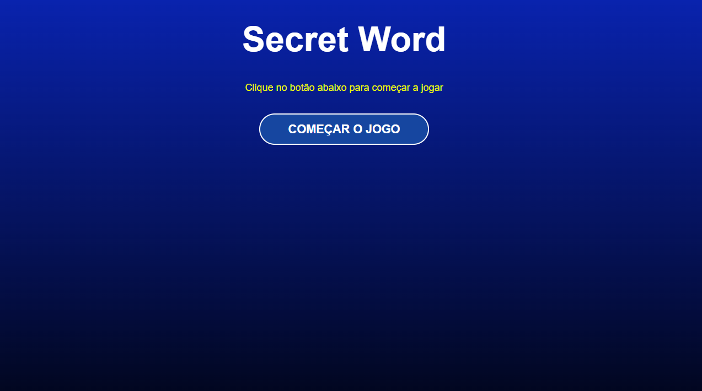
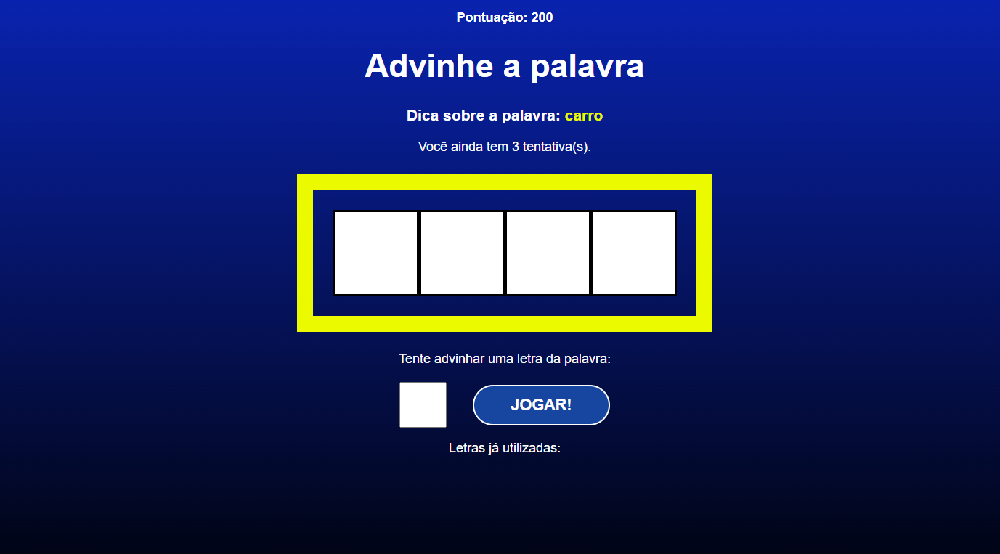
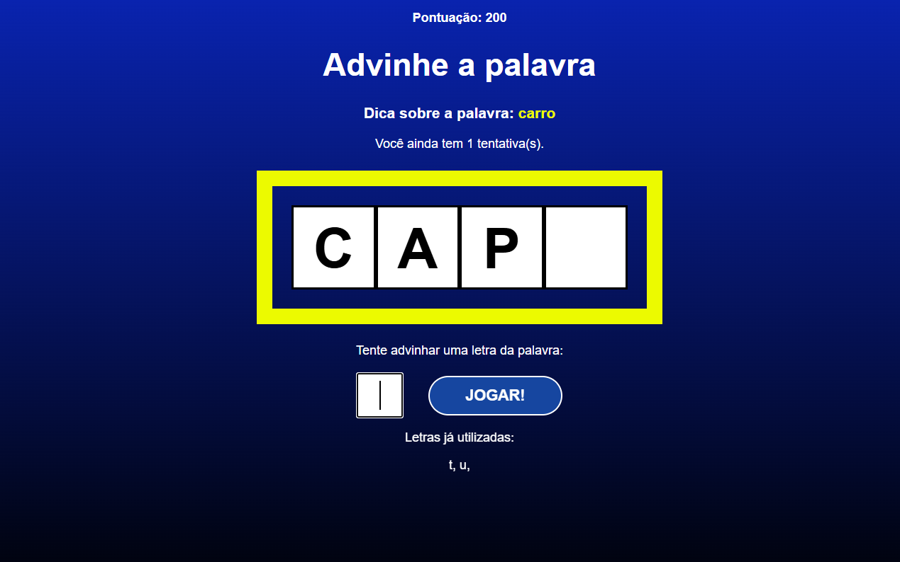
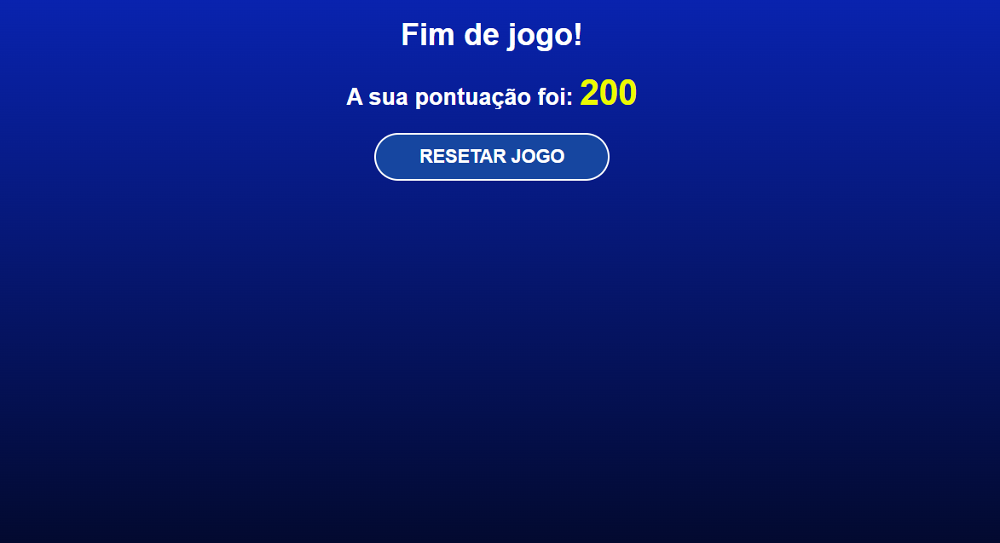

# 🎉 Bem-vindo ao Secret Word 🚀
Este projeto foi desenvolvido durante o curso de React do Professor Matheus Battist. Nele foram colocados em prática os conhecimentos adquiridos nos primeiros módulos do curso.

## Sobre o projeto
Secret Word é um jogo de adivinhação de palavras.
Contém dicas da palavra a ser adivinhada, quantidade de tentativas, pontuação e lista com as letras já utilizadas.

### Tela inicial

### Início do jogo

### Adivinhando a palavra

### Fim de jogo
